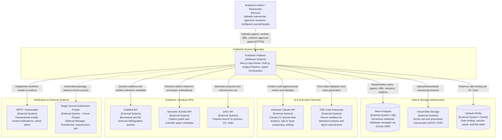
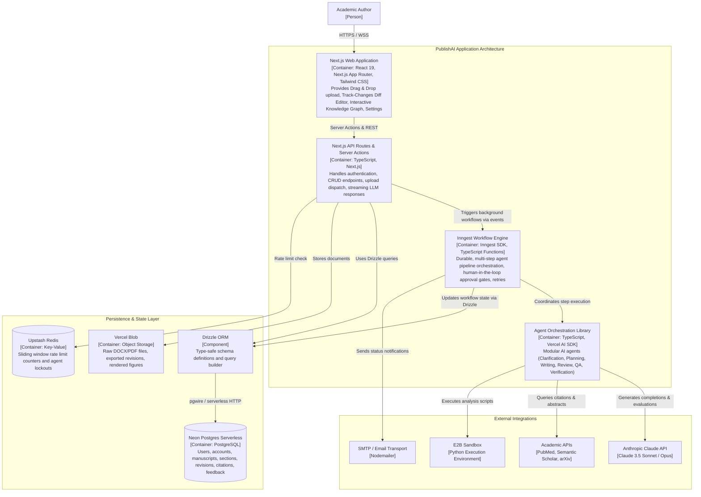

# PublishAI - C4 Architecture Diagrams

This document specifies the C4 Model architecture for **PublishAI**, an AI-driven academic manuscript revision and journal submission platform.

---

## 1. C4 Level 1: System Context Diagram

The System Context diagram provides a high-level view of how academic authors interact with PublishAI and how the platform connects to external services and infrastructure.

---

## 2. C4 Level 2: Container Diagram

The Container diagram zooms into the PublishAI platform boundary to show high-level technical building blocks and their protocols.

---

## 3. Multi-Agent Orchestration Pipeline

PublishAI organizes paper revision through a structured, multi-step pipeline with explicit **User Approval Gates** to maintain human control and academic integrity.

```mermaid
flowchart LR
    A["1. Clarification Agent<br>(Sonnet)<br>Target journal criteria & constraints"] --> B["2. Planning Agent<br>(Opus)<br>Manuscript triage & revision plan"]
    B --> Gate1{"User Approval<br>Gate: Plan"}
    Gate1 -->|"Approved"| C["3. Knowledge Agent<br>(Sonnet)<br>Literature enrichment & references"]
    C --> D["4. Scientific Review Agent<br>(Opus Debate)<br>Methodological & logical scrutiny"]
    D --> E["5. Academic Writing Agent<br>(Opus)<br>Section-by-section rewrite"]
    E --> F["6. Execution Agent<br>(Opus)<br>Unified diff & track changes"]
    F --> Gate2{"User Approval<br>Gate: Diffs"}
    Gate2 -->|"Approved"| G["7. QA Agent<br>(Sonnet)<br>Formatting, references, consistency"]
    G --> H["8. Verification Agent<br>(Sonnet)<br>Peer review score & Cover letter"]
    H --> I["9. Compilation Agent<br>(Sonnet)<br>Final DOCX/PDF generation"]
```

---

## 4. Key Architectural Characteristics

1. **Human-in-the-Loop Governance**: AI never mutates a manuscript without author confirmation at the Plan gate and Diff gate.
2. **Durable Asynchronous Execution**: Inngest decouples lengthy LLM calls (which may take several minutes) from web request lifecycles, ensuring resilience against timeouts.
3. **Type-Safe Data Contract**: Drizzle ORM provides strict TypeScript types directly derived from the PostgreSQL database schema.
4. **Separation of Concerns**: Fast lightweight tasks (parsing, metadata search, QA) leverage Claude 3.5 Sonnet, while heavy analytical synthesis (scientific critique, revision drafting) uses Claude 3.5 Opus.
