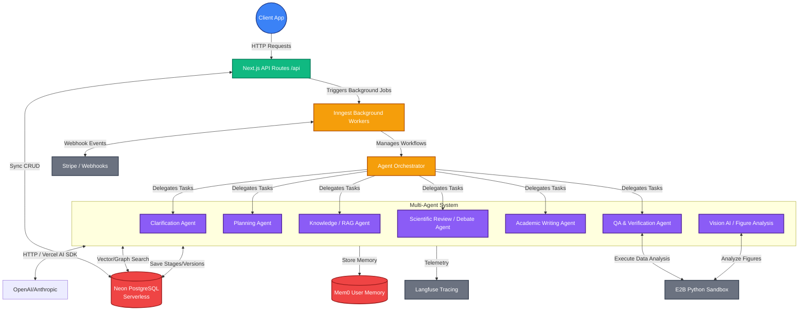
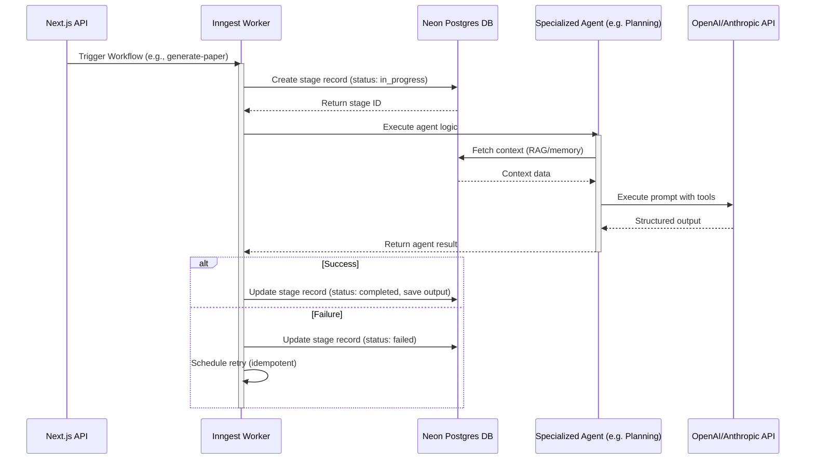
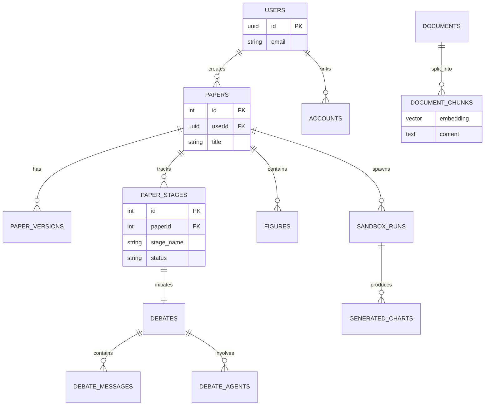
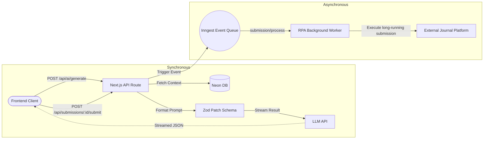

# Publish AI - Backend Architecture Analysis

## 1. System Architecture Overview

The backend of **Publish AI** is built on top of a highly scalable, serverless-first stack. The primary architecture follows the **Next.js 13+ App Router** paradigm, utilizing `/src/app/api` for synchronous endpoints and **Inngest** for orchestrating complex, long-running, multi-agent background workflows.

### Architecture Diagram

---

## 2. Core Business Logic & Orchestration

The core logic of generating academic manuscripts revolves around a **multi-stage agentic pipeline**. The complexity of writing, reviewing, and defending scientific papers is broken down into modular steps managed by a central Agent Orchestrator.

### The Agent Orchestrator (`src/services/agents/orchestrator.ts`)

Instead of a single monolithic LLM prompt, the application defines individual agents handling distinct `stages` of the manuscript creation process. These agents are executed sequentially (and sometimes repetitively for revisions) via **Inngest Functions**.

### Orchestration Sequence Flow

### Multi-Agent Debate
A unique mechanism in Publish AI is the **Scientific Review Debate**, triggered by submission review events. The backend dynamically orchestrates multiple LLM personas (e.g., Methodologist, Subject Matter Expert, Skeptic) simulating peer review.

---

## 3. Data Access Layer (DAL) & ORM (`src/services/db`)

The application uses **Drizzle ORM** communicating with a **Neon PostgreSQL** serverless database. 

### Database Schema Entity-Relationship

---

## 4. API Routes Analysis (`src/app/api`)

The `src/app/api` layer acts as the synchronous interface for the frontend, delegating heavy processing to background queues while immediately responding to user interactions.

### API Data Flow

---

## 5. Core AI Service & Modularity (`src/services/ai/aiService.ts`)

The AI capability relies on a unified fallback-aware wrapper, abstracting Anthropic and OpenAI behind a robust middleware interface. This ensures that the system is resilient to vendor downtime or strict rate limits.

### Advanced Capabilities
1. **Integrated Fallbacks**: Cascades down a predefined chain (e.g., Claude 3.7 Sonnet -> Claude 3.5 Sonnet -> GPT-4o).
2. **Prompt Sanitation**: Injects strict defenses against delimiter-based injection attacks.
3. **Memory Injection**: Dynamically connects to user memory stores.
4. **Langfuse Telemetry**: Automatically records all inputs, outputs, tokens, and latencies.

## 6. Execution Sandbox
For data-heavy papers, the application automates data analysis via E2B Python Sandbox to execute dynamically generated Python scripts safely.
