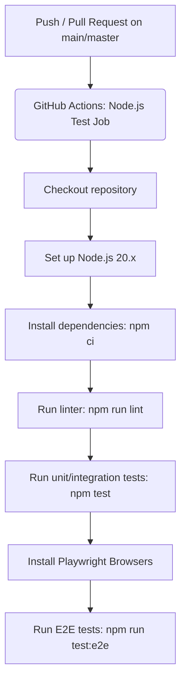
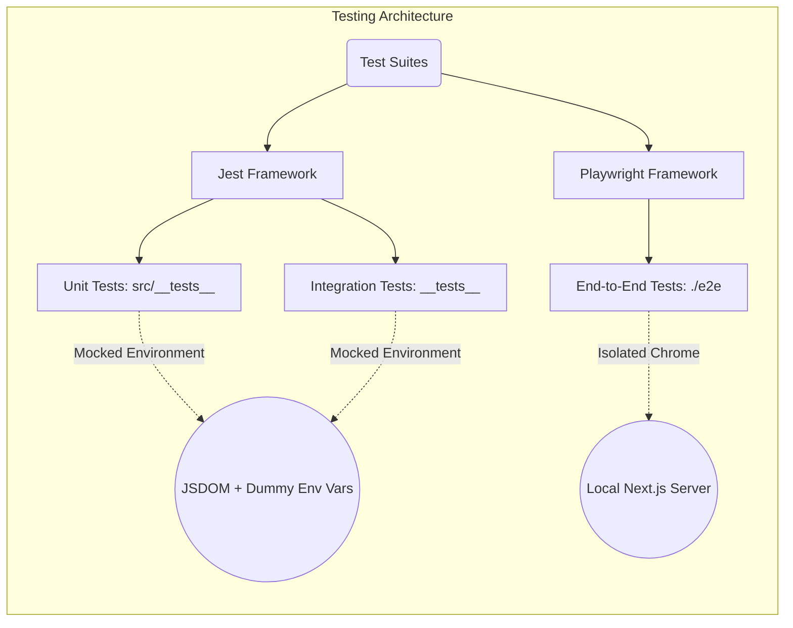
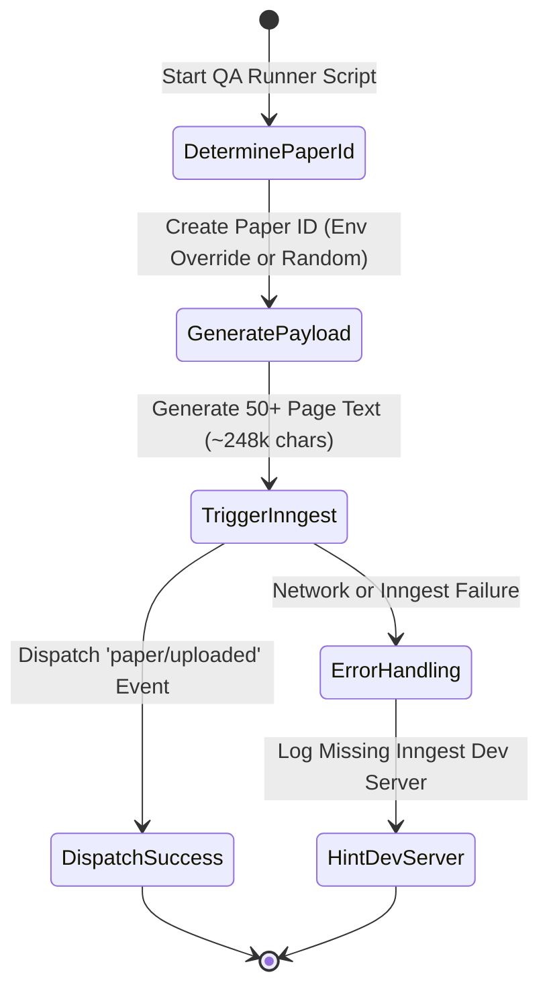

# DevOps, Testing Strategy & Project Configuration Analysis

This comprehensive report outlines the infrastructure, testing methodologies, scripts, and root configuration files driving the `publish-ai` project. 

## 1. Project Configuration Overview

### Next.js & Frontend Configuration (`next.config.ts`)

The project utilizes **Next.js 16.3.5** with strong security and performance optimizations. The configuration file `next.config.ts` includes extensive customizations for security headers and optimization of complex UI/DB libraries.

**Key Highlights:**
- **Security Headers**: Injects robust headers globally, including a strict Content Security Policy (CSP), HSTS (`max-age=31536000`), XSS Protection, and explicit `Permissions-Policy`.
- **Server External Packages**: Expressly exempts Node-native/binary packages from Webpack bundling (e.g., `pdf-parse`, `mammoth`, `xlsx`, `docx`, `sharp`, `pg`) to prevent build failures.
- **Experimental Optimizations**: Turns on `optimizePackageImports` for heavy UI libraries and database drivers.
- **Internationalization (i18n)**: Configured using `next-intl` via `createNextIntlPlugin`.

### Database ORM (`drizzle.config.ts`)
Database interactions are managed via **Drizzle ORM** communicating with a Serverless PostgreSQL database (Neon):
- Points to schemas in `src/services/db/schema.ts` and `src/services/db/schema/embeddings.ts`.
- Migrations are output directly to `src/services/db/migrations`.
- Securely retrieves the database URL from `.env` or `.env.local`.

---

## 2. CI/CD Pipeline (`.github/workflows/ci.yml`)

The repository leverages **GitHub Actions** for Continuous Integration. The pipeline is highly streamlined, running linters and both Jest and Playwright test suites.

**Commands used during CI:**
- `npm ci`: Ensures deterministic, clean dependency installation.
- `npm run lint`: Validates code style and static correctness.
- `npm test -- --passWithNoTests`: Executes the Jest test suite, dynamically transforming modern packages (via custom jest.config.js mappings).
- `npx playwright install --with-deps`: Fetches required browsers for Playwright.
- `npm run test:e2e`: Runs E2E tests, which also spins up a Next.js server if one isn't active.

---

## 3. Testing Strategy & Structure

The testing ecosystem relies on a bifurcated approach: **Jest** (Unit & Integration) and **Playwright** (End-to-End).

### Jest Framework (Unit & Integration Tests)
- **Configuration (`jest.config.js`)**: Leverages `next/jest` for Next.js-aware SWC compilation. 
  - Overrides `transformIgnorePatterns` for Modern ESM packages such as `@ai-sdk`, `@modelcontextprotocol`, `@langchain`, `langsmith`, and `e2b` to prevent compilation errors.
  - Excludes the `<rootDir>/e2e/` folder from unit test runs.
- **Environment Parity**: 
  - `jest.custom-env.js` extends JSDOM to provide modern Web APIs frequently used in Next.js/Edge contexts (`fetch`, `ReadableStream`, `TextEncoder`).
  - `jest.env.js` provides safe, dummy environment variables ensuring tests do not accidentally query production data or fail due to missing keys.

**Directory Structure for `__tests__` and `src/__tests__`**:
Tests are distributed across both `__tests__/` (generally high-level services and pages) and `src/__tests__/` (components, APIs, utilities). 

### Playwright (End-to-End Tests)
- **Configuration (`playwright.config.ts`)**: 
  - Executes isolated Chrome/Chromium tests located in the `./e2e` directory.
  - Automatically spins up the server via `npm run dev` for tests.
  - Injects mocked environments (`NEXT_PUBLIC_E2E_TEST: 'true'`, dummy `DATABASE_URL` and `AUTH_SECRET`).

---

## 4. Automation Scripts (`src/scripts/*`)

The project ships with standalone utility scripts executed via `tsx` for DevOps, QA, and bootstrapping.

### `qa-runner.ts` (QA Simulator)
Programmatically triggers an `Inngest` event payload simulating an enormous document (~248,000 characters; equivalent to 50+ pages). Designed to verify text-chunking algorithms and vectorization pipelines.

### `load-test.ts` (Concurrency/Stress Tester)
Spawns concurrent paper upload events hitting the Inngest queue at exactly the same time. This script tests the Neon DB connection pooling capabilities and Inngest's handling of bursting workloads.

### `env.ts` (Environment Validator)
- Centralizes environment variable loading.
- Enforces strict checks ensuring `DATABASE_URL` is neither missing nor pointing to a local dummy placeholder.
- Wraps the `Inngest` client instantiation.

### `seed.ts` (Database Seeder)
- Performs an **idempotent** seed of "enriched journal data" into the Neon Postgres database.

---

## Conclusion

The configuration, devops, and testing methodology emphasize **security, scalability, and local developer experience**. The architecture splits testing responsibilities cleanly between unit logic (Jest) and full integration (Playwright), heavily integrating with modern AI workflows (Inngest queues, Drizzle/Neon). The suite of custom CLI scripts acts as a powerful devops toolkit to test scaling, idempotency, and the resiliency of the processing pipeline under heavy concurrency.
