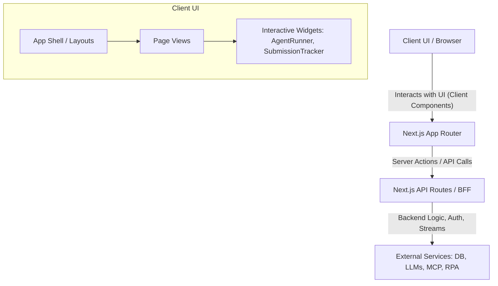
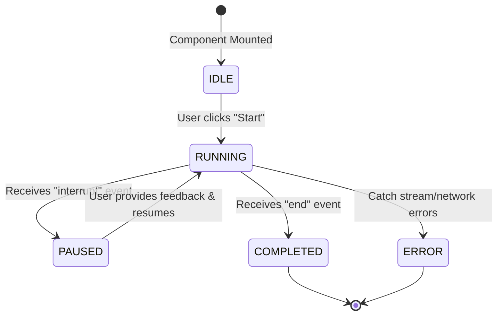
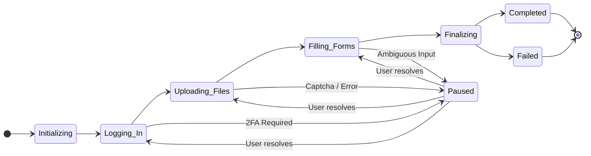
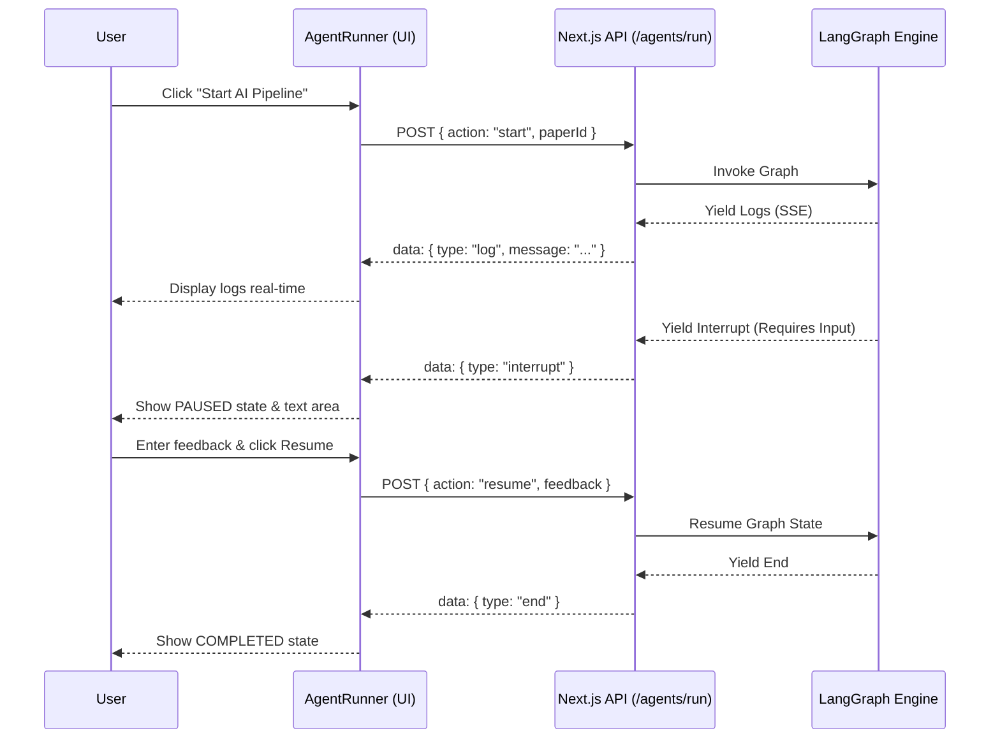
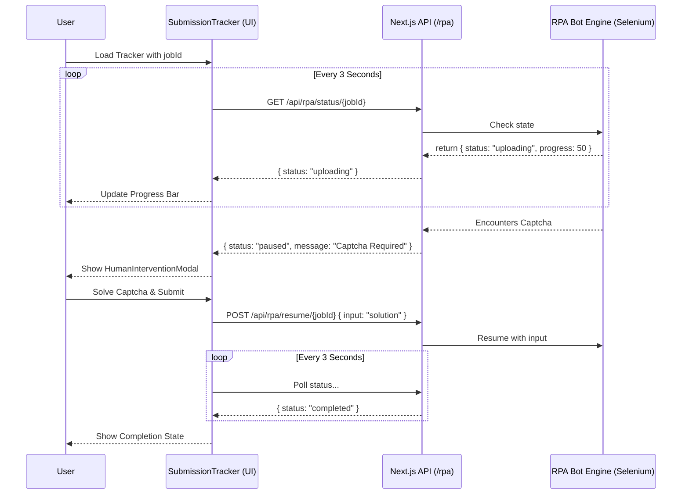

# Frontend Architecture Analysis: PublishAI (Comprehensive & Visual)

## 1. Architecture Overview

The PublishAI project utilizes a modern frontend architecture built on **Next.js 16.3.5** leveraging the **App Router** (`src/app`). It follows a robust server-client separation strategy, effectively splitting server-side logic and API routes from interactive, stateful client components (`"use client"`).

The application is fully internationalized (i18n) using `next-intl`, implementing a `[locale]` dynamic route at the root level to support multiple languages (including right-to-left languages like Hebrew). Authentication is handled securely via **Next-Auth** (`v5 beta`), with global password protection mechanisms built directly into the main application layout.

### High-Level Component Architecture

## 2. Directory Structures & Routing Strategy

Routing in the application is strictly managed through the Next.js App Router. The `[locale]` dynamic segment wraps the entire application to ensure layout-level localization.

- **`src/app/[locale]/(dashboard)`**: Contains the core authenticated views (Admin, Analytics, Journals, Learning, Papers, RLHF, Settings).
- **`src/app/api`**: Acts as a Backend-For-Frontend (BFF) handling NextAuth, agent execution streaming, knowledge graph logic, MCP (Model Context Protocol) integrations, and webhook processing.
- **`src/components`**: Highly modularized and domain-driven, featuring dedicated folders for the editor, literature review, multi-agent debates, ping-pong revision viewers, RPA trackers, and a unified `ui/` folder for base Shadcn/Radix components.

## 3. Key Components Deep Dive

### 3.1 `AgentRunner` (Client Component)
**Path:** `src/components/dashboard/AgentRunner.tsx`

`AgentRunner` handles the real-time execution of the AI pipeline. It uses Server-Sent Events (SSE) via the Fetch API (`ReadableStreamDefaultReader`) to ingest streaming logs line-by-line. 

**Key Responsibilities:**
- **Streaming Ingestion**: Parses JSON payloads prefixed with `data: ` out of the ongoing stream to continuously render what the LangGraph engine is doing in the background.
- **Human-in-the-Loop Handling**: Listens for specific `interrupt` event types. When triggered, the UI flips to a `PAUSED` state, pausing the stream and presenting the user with an input form to guide or correct the agent.
- **Resume Mechanism**: Sends a new POST request containing the user's feedback, which unblocks the agent on the backend and resumes the SSE stream.

#### Agent State Machine

### 3.2 `SubmissionTracker` (Client Component)
**Path:** `src/components/rpa/SubmissionTracker.tsx`

`SubmissionTracker` monitors an autonomous RPA job navigating journal submission systems. Because the backend uses an asynchronous Selenium/Playwright worker, a continuous stream isn't viable. Instead, this component relies on short polling.

**Key Responsibilities:**
- **Status Polling**: Every few seconds, the component pings the `/api/rpa/status/[jobId]` endpoint to retrieve the current phase (e.g., uploading, filling forms) and updates a localized progress bar.
- **Intervention Modals**: If the bot encounters a CAPTCHA, MFA prompt, or an ambiguous form field it cannot parse, the backend flags the job as `paused`. The UI responds by triggering a modal where the user can manually solve the obstacle.
- **Lifecycle Cleanup**: Once the endpoint returns terminal states (`completed`, `failed`, `error`), the polling automatically halts.

#### RPA Submission States

### 3.3 Other Notable Components
- **`PaperProcessingUI`**: Visualizes the 11-step AI processing pipeline. Provides high-level abstractions over `AgentRunner`.
- **`KnowledgeGraphViewer`**: Implements `react-force-graph-2d` for visual representations of entities and literature references found during the `stage1` knowledge gathering phase.
- **`MultiAgentDebatePanel`**: Renders real-time discussions between multiple LLM roles (e.g., Reviewer 1, Reviewer 2, Meta-Reviewer).

## 4. State Management Strategy
The application eschews global state managers like Redux in favor of:
1. **React Hooks**: standard `useState`, `useEffect`, and `useRef` handles local UI state.
2. **Server State (BFF)**: Data fetching maps directly to `/api/` endpoints relying on React's data fetching and caching lifecycles.
3. **Streaming/SSE State**: State is derived iteratively from real-time stream chunks rather than holding entire logs in memory before rendering.

## 5. Sequence Diagrams for Core Workflows

### A. The Agent Pipeline (AI Revision Flow)

### B. Autonomous RPA Submission

## 6. UI Libraries & Tooling
- **Tailwind CSS v4**: Utility-first styling for layout and themes.
- **Framer Motion v13**: Handles animations like the `AnimatedSidebar`.
- **Next-Intl**: Implements full RTL/LTR switching dynamically based on locale (e.g. Hebrew vs English).
- **Tiptap**: Advanced WYSIWYG editor implementation (`RichDocumentEditor`).
- **Recharts & ForceGraph**: Data visualization across analytics and connections modules.
