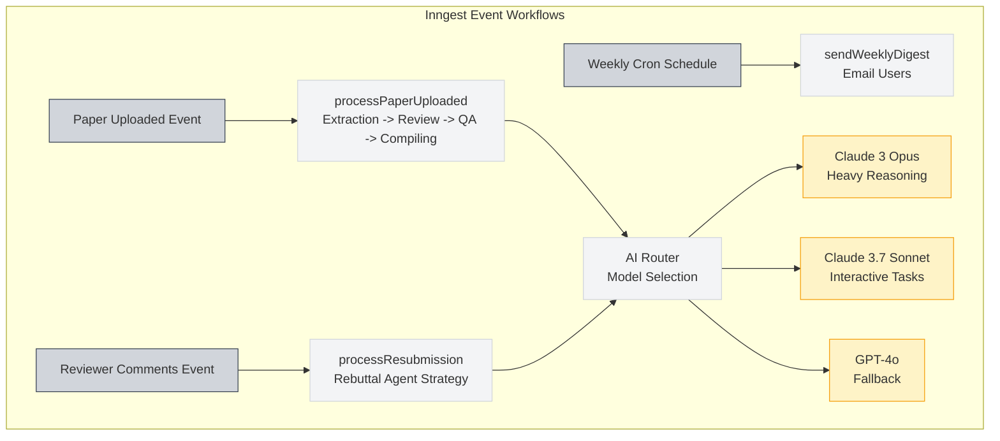
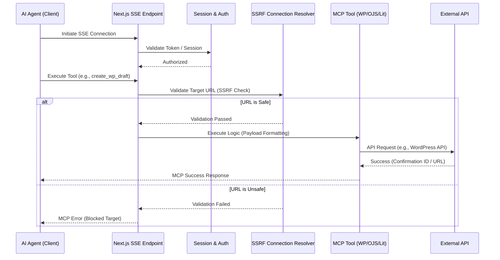
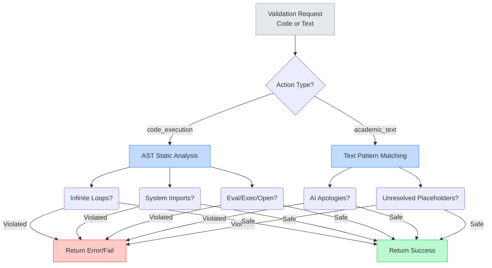
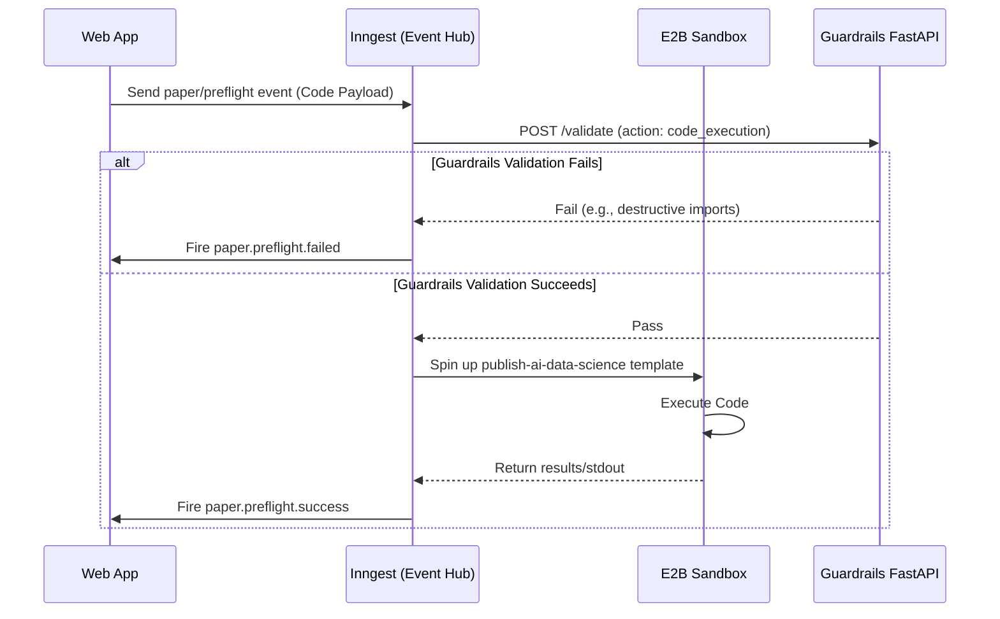

# Publish AI: Integrations & Background Architecture Analysis

This document provides a detailed visual analysis of the background job processing, event-driven architecture, Model Context Protocol (MCP) servers, sandboxing, and Python microservices within the Publish AI project.

## 1. Event-Driven Architecture & Background Jobs (Inngest)

Publish AI heavily utilizes **Inngest** for orchestrating complex, long-running AI workflows without blocking the main Next.js web application.

### Events & Workflows
The domain events are strictly typed and drive the core architecture. Key workflows include:
- **Paper Processing Pipeline:** Triggered when a paper is uploaded. The paper undergoes multiple sequential stages.
- **Resubmission & Rebuttal:** Triggered when reviewer comments are received.
- **Cascading Workflows:** Manages rejections and multi-agent debates securely.
- **Preflight Checks:** Runs AI-generated code snippets in a sandbox before final execution.
- **External Webhooks:** Handles incoming signals from Stripe and external email servers.

### AI Routing
Tasks are dynamically routed to specific LLMs based on complexity:
- **Claude-3-opus:** Heavy reasoning tasks.
- **Claude-3.7-sonnet:** Interactive and moderately complex tasks.
- **GPT-4o:** Serves as the default fallback model.

## 2. MCP (Model Context Protocol) Servers

The platform exposes several MCP servers via Server-Sent Events (SSE) to allow AI agents to safely interact with external publication platforms and literature databases.

### Infrastructure & Security
- **SSE Transport:** Next.js App Router endpoints establish SSE connections.
- **Authentication:** Requires authorization via NextAuth user sessions, Bearer tokens, or API keys.
- **SSRF Defense:** A Connection Resolver rigorously validates target URLs to protect against Server-Side Request Forgery.

### Supported Servers
- **WordPress MCP Server:** Exposes tools to test connections and create WordPress drafts.
- **Literature MCP Server:** Provides tools to search literature databases.
- **OJS MCP Server:** Interfaces natively with Open Journal Systems.

## 3. Data Science Sandbox (E2B)

For secure execution of untrusted AI-generated code, the platform uses **E2B**.
The data science sandbox uses an Ubuntu base image heavily loaded with numerical, scientific, and data analysis dependencies like Pandas, SciPy, NumPy, Statsmodels, Matplotlib, Seaborn, and Scikit-learn.

## 4. Guardrails Microservice (Python)

To ensure AI outputs are safe, professional, and do not execute malicious code, a standalone FastAPI microservice (`guardrails-service`) is utilized.

### Validation Strategies
1. **Code Execution Guard:** Statically analyzes Python code payloads via an Abstract Syntax Tree (AST) before allowing them to run.
2. **Academic Text Guard:** Filters LLM-generated prose to ensure high academic standards.

### Preflight Code Execution Sequence

